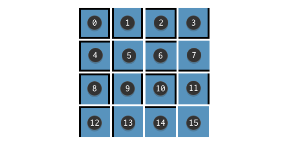
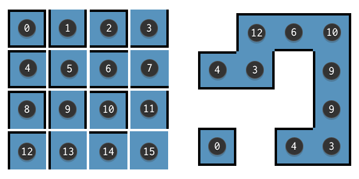
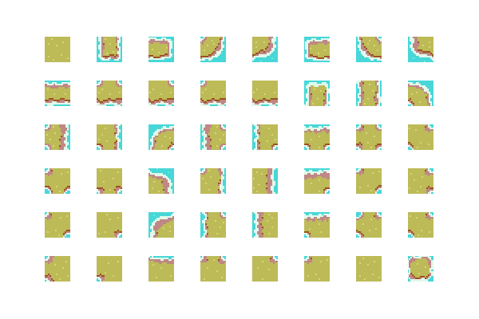

>翻译原文[ **How to Use Tile Bitmasking to Auto-Tile Your Level Layouts**](https://gamedevelopment.tutsplus.com/tutorials/how-to-use-tile-bitmasking-to-auto-tile-your-level-layouts--cms-25673)  
>作者：[Sonny Bone](https://tutsplus.com/authors/sonny-bone?_ga=2.43407781.1498507388.1525587223-935390019.1525587223)

 &nbsp; &nbsp; &nbsp; &nbsp;制作具有视觉吸引力和多样化的瓷砖组是一个耗时的过程，但结果往往是值得的。但是，即使在创作了艺术品之后，你仍然必须将它们拼凑在一起！  
 &nbsp; &nbsp; &nbsp; &nbsp;您可以手动设置每个瓦片(tile)，也可以使用Tile Bitmasking自动执行该过程，因此您只需绘制地形图的形状即可。

## **什么是Tile Bitmasking** ##

&nbsp; &nbsp; &nbsp; &nbsp;Tile Bitmasking是一种从定义好的瓦片(tile)图集中选择合适的图的方法。这使您可以在任何想要显示特定类型地形的地方放置通用占位符图块，而不必手动从众多图集里面选择图片放置。

>演示视频地址：https://youtu.be/YhX-i3GutrI

(你可以从github下载到本文章的[demo和源码](https://github.com/tutsplus/Tile-Bitmasking))

&nbsp; &nbsp; &nbsp; &nbsp;在处理多种类型地形时，不同变化的数量可以超过300个或更多tiles。绘制这么多不同的精灵（sprite）肯定是一个耗时的过程，但是Tile Bitmasking保证了放置这些瓦片(tile)的快速性和高效性。  

&nbsp; &nbsp; &nbsp; &nbsp;使用Bitmasking，地图可以在运行时（runtime）被生成，只需要一些小调整，你就可以在游戏过程中拓展Bitmasking来动态改变瓦片。在这个教程中，我们将学习Tile bitmasking的基础知识，同时我们以后使用角落瓦片（corner tile）和多种复杂地形类型打下基础

## **Tile Bitmasking的原理** ##
### 概观 ###
&nbsp; &nbsp; &nbsp; &nbsp;Tile Bitmasking就是计算一个数值并根据该值分配一个特定的精灵（sprite）。每个图块都会检查其相邻图块，从而确定要从该图集中分配哪个精灵。  
&nbsp; &nbsp; &nbsp; &nbsp;在图集中每个精灵都被编号，并且bitmasking计算返回对应于图集中的精灵位置的数字编号。在运行时，执行bitmasking，每个瓦片会使用合适的精灵更新

  
&nbsp; &nbsp; &nbsp; &nbsp;上面这张图集中包含了所有有可能是边界配置瓦片。每个瓦片都被标记了bitmasking值，我们在下面学习如何计算这些值。现在，我们要懂得bitmasking的值如何与图集编号关联的，这些精灵是按照顺序排列的，所以第一个精灵的bitmasing值是0，到第16个精灵的值是15.

### 计算bitmasking的值 ###

&nbsp; &nbsp; &nbsp; &nbsp;计算这个值是比较简单的，在这个例子中，我们假设一个没有角落的单一地形类型。

&nbsp; &nbsp; &nbsp; &nbsp;我们检查每一个瓦片是否有北、西、东和南四个方向的瓦片，并且每个方向返回一个布尔值，0代表是不存在其他地形瓦片，1代表存在其他地形的瓦片。

&nbsp; &nbsp; &nbsp; &nbsp;将这个布尔值与二进制方向相乘，然后与其他bitmasking值相加。我们通过一个示例理解一下

#### 4位方向值 ####
&nbsp; &nbsp;北 = 20 = 1
&nbsp; &nbsp;西 = 21 = 2
&nbsp; &nbsp;东 = 22 = 4
&nbsp; &nbsp;南 = 23 = 8

---

>备注：黄色区域代表存在瓦片

&nbsp; &nbsp; &nbsp; &nbsp;上图的绿色方块代表我们正在计算的地形瓦片。我们开始检查北方向的瓦片，没有瓦片在北方向，所以这个布尔值价差结果是0，我们将0和北方向的值（ 20 = 1）相乘，得到 1 * 0 = 0。  
&nbsp; &nbsp; &nbsp; &nbsp;对于完全由空白地形包围的瓦片，每个布尔值检查结果都是0，计算四个方向值 就是  **0000** 或者1 * 0 + 2 * 0 + 4 * 0 + 8 * 0 = 0。总共有16种可能的组合，从 0到 15，所以第一个精灵（值为0）将被用来填充中间的瓦片。

---

&nbsp; &nbsp; &nbsp; &nbsp;上图地形存在北方向的单个瓦片，所以二进制值是 **0001** 即 1 * 1 + 2 * 0 + 4 * 0 + 8 * 0 = 1，所以中间瓦片用图集中2号精灵（值为1）作为地形

---

&nbsp; &nbsp; &nbsp; &nbsp;上图地形中，存在北和东方向瓦片，所以二进制值是 **0101** 即 1 * 1 + 2 * 0 + 4 * 1 + 8 * 0 = 5，所以中间瓦片用6号精灵（值为5）作为地形

---
  

&nbsp; &nbsp; &nbsp; &nbsp;上图地形中，存在东和西方向瓦片，所以二进制值是 **0110** 即 1 * 0 + 2 * 1 + 4 * 1 + 8 * 0 = 6，所以中间瓦片用7号精灵（值为6）作为地形

---

### 分配精灵给瓦片 ###
&nbsp; &nbsp; &nbsp; &nbsp;我们在计算好每个瓦片的bitmasking值后，从图集中分配指定的精灵给瓦片。这是在地图实时加载执行的最后一步，我们可以保存它，然后加载到自己的编辑器里进一步的编辑完善。

---
  

&nbsp; &nbsp; &nbsp; &nbsp;上图中，左边图代表4-bit 单一地形的图集，右图代表，用bitmasking处理后，在游戏中的形成的地形。  
&nbsp; &nbsp; &nbsp; &nbsp;举个例子，我们检查右图右上方角落瓦片，它被西方向和南方向瓦片包围，这个布尔值检查返回一个二进制值 **1010** 或者是 1 * 0 + 2 * 1 + 4 * 0 + 8 * 1 = 10，所以角落对应这图集中的第11号精灵（值为10）  

上图中，左边图代表4-bit 单一地形的图集，右图代表，用bitmasking处理后，在游戏中的表现地形。

## **8位Bitmasking值和角落瓦片** ##  
&nbsp; &nbsp; &nbsp; &nbsp; 在这个示例中，我们创建一个自上而下的海洋附近草地的瓦片图集。这种情况，我们海洋在地形瓦片下面一层，这个方案可以让我们用单一地形，但仍可以保持两种地形互相结合的感觉。  
&nbsp; &nbsp; &nbsp; &nbsp;bitmasking程序随着游戏的运行完成，这些精灵将不会改变，这是一个无缝，静态的bitmasking的实现，玩家在看见这些瓦片之前完成。  
### 角落瓦片简介 ###  
&nbsp; &nbsp; &nbsp; &nbsp;我们希望得到一个比之前4位地形视觉效果更好的地形图，所以角落部分是不可或缺的。对于艺术家，程序员 和游戏本身来说，额外的复杂的视觉表现是一个额外的指数级工作量。通过拓展我们刚学习的4位方案，我们可以快速理解8位地形方案。  

 
&nbsp; &nbsp; &nbsp; &nbsp;这个是我们整个海洋瓦片地形所需要精灵的图集。你注意到这个瓦片的数量了么？之前4位地形示例是24 = 16个瓦片，所以8位地形示例应该需要28 = 256个瓦片，但是我们图中精灵明显少于这个数量。  
&nbsp; &nbsp; &nbsp; &nbsp;虽然8位bitmasking流程有256种组合的二进制值，但是并非每一种组合都需要一个唯一的瓦片，下面示例帮助我们解释了为什么256种组合只需要48个瓦片。  

### **8位方向值** ###
&nbsp; &nbsp;西北 = 20 = 1  
&nbsp; &nbsp;北 = 21 = 2  
&nbsp; &nbsp;东北 = 22 = 4  
&nbsp; &nbsp;西 = 23 = 8  
&nbsp; &nbsp;东 = 24 = 16  
&nbsp; &nbsp;西南 = 25 = 32  
&nbsp; &nbsp;南 = 26 = 64  
&nbsp; &nbsp;东南 = 27 = 128  

---

  
&nbsp; &nbsp; &nbsp; &nbsp;现在我们做8个布尔值检查，中间的瓦片边上有北，东北，东瓦片，所以布尔值检查返回一个布尔值 **00010110** 即 1 * 0 + 2 * 1 + 4 * 1 + 8 * 0 + 16 * 1 + 32 * 0 + 64 * 0 + 128 * 0 = 22

---
   
&nbsp; &nbsp; &nbsp; &nbsp;上面作图与之前的地形图相似，但是现在边上多了西南和东南两块瓦片，所以布尔值检查返回的二进制值是 **10110110** 即 1 * 0 + 2 * 1 + 4 * 1 + 8 * 0 + 16 * 1 + 32 * 1 + 64 * 0 + 128 * 1 = 182.   

&nbsp; &nbsp; &nbsp; &nbsp; 这个值与之前的地形图是不同的，但是两个图视觉上面是相似的，所以它变得很多余。  
&nbsp; &nbsp; &nbsp; &nbsp; 为了消除冗余。我们增加一个额外的条件到我们布尔值方向检查上面：当我们检查到角落瓦片的存在时，我们还必须检查一下四个基本方向（东南西北）的临近瓦片。  
&nbsp; &nbsp; &nbsp; &nbsp; 举个例子，上图中东北方向的瓦片边上存在东和北瓦片，但是东南瓦片和西南瓦片边上不存在瓦片，所以东南瓦片和西南瓦片不参与bitmasking的计算。
>注：作者意思是，角落瓦片边上都存在瓦片才能参与bitmasking计算，东南的瓦片少了一个南方向瓦片，所以也不参与计算。  

&nbsp; &nbsp; &nbsp; &nbsp; 添加了新条件，所以上图布尔值检查返回的二进制检查新的结果是 **00010110** 即 1 * 0 + 2 * 1 + 4 * 1 + 8 * 0 + 16 * 1 + 32 * 0 + 64 * 0 + 128 * 0 = 22。现在你可以看到为什么256种组合只需要48个瓦片  

### **瓦片顺序** ###
&nbsp; &nbsp; &nbsp; &nbsp;另外一个你需要注意得问题就是，8bit计算程序计算出来的额值不再和瓦片图集里面得顺序相关，这里只有48个瓦片，但是我们计算出来得值得范围是0-255，所以，我们不在用计算出来得值直接挑出瓦片所需得精灵贴图。  
&nbsp; &nbsp; &nbsp; &nbsp;因此，我们需要一个数据结构来包含计算值列表及其相应的瓦片值。你想如何实现这一点取决于你，但请记住，检查周围瓦片的顺序决定了瓦片应放置在精灵表中的顺序。   
&nbsp; &nbsp; &nbsp; &nbsp;在这个例子中，我们按照以下顺序检查边界地面瓦片：西北，北，东北，西，东，西南，南，东南。  
&nbsp; &nbsp; &nbsp; &nbsp;下面是一组完整的位bitmasking值，因为它们与我们精灵表中的贴图位置有关（可以在项目中随意使用这些值来节省时间）：
>{ 2 = 1, 8 = 2, 10 = 3, 11 = 4, 16 = 5, 18 = 6, 22 = 7, 24 = 8, 26 = 9, 27 = 10, 30 = 11, 31 = 12, 64 = 13, 66 = 14, 72 = 15, 74 = 16, 75 = 17, 80 = 18, 82 = 19, 86 = 20, 88 = 21, 90 = 22, 91 = 23, 94 = 24, 95 = 25, 104 = 26, 106 = 27, 107 = 28, 120 = 29, 122 = 30, 123 = 31, 126 = 32, 127 = 33, 208 = 34, 210 = 35, 214 = 36, 216 = 37, 218 = 38, 219 = 39, 222 = 40, 223 = 41, 248 = 42, 250 = 43, 251 = 44, 254 = 45, 255 = 46, 0 = 47 }   

## **多地形类型** ##  
&nbsp; &nbsp; &nbsp; &nbsp;我们之前的例子都是用的单一地形类型，但是如果我们在程序中加入第二种地形呢？我们需要一个5-bit bitmasking 方案，然后我们需要定义我们的两种地形类型。我们也需要在特殊条件下计算中间一个瓦片设定一个值。记住，我们不需要像前面的例子一样，计算空白瓷砖，现在的瓦片必须被其他瓦片包围。

---
  
&nbsp; &nbsp; &nbsp; &nbsp;上图示例中是两种不带角落瓦片的地形，每当定向检测到地形1的时候，它总是返回0值，只有是地形2的时候，才会计算和使用中间瓦片值。  
&nbsp; &nbsp; &nbsp; &nbsp;上面示例中，中间瓦片被北，西，东地形2的瓦片和 南方向地形1的瓦片包围，中间瓦片的地形类型是1，所以南方向瓦片不能被计算在内，布尔检查返回二进制值为 **00111** 即 1 * 1 + 2 * 1 + 4 * 1 + 8 * 0 + 16 * 0 = 7  

---
  
&nbsp; &nbsp; &nbsp; &nbsp;在这个示例，我们中间瓦片类型是2，所以它将参与计算。中间瓦片被北边，西边的地形2瓦片包围，也被东边和南边地形1的瓦片包围，所以布尔检查返回一个二进制值 **10011** 即 1 * 1 + 2 * 1 + 4 * 0 + 8 * 0 + 16 * 1 = 19  

---

## **动态实现** ##

bitmasking计算也可以在游戏过程中执行，以便实时更改拼贴的位置和外观。这对于可破坏的地形以及允许制作和建造的游戏非常有用。初始位bitmasking程序对于所有图块都是强制性的，但只有在绝对必要时才应执行任何其他动态计算。例如，一个被破坏的地形图块只会触发周围图块的位掩码计算。
## **结论** ##

瓦片bitmasking是构建工作系统以帮助您进行游戏开发的完美示例。这不直接影响玩家的体验;相反，这种使关卡设计的耗时部分自动化的方法为开发人员带来了宝贵的好处。简单地说：瓦片bitmasking是让你从繁重的地图制作游戏工作中部分解放，让你专注于更重要的任务。